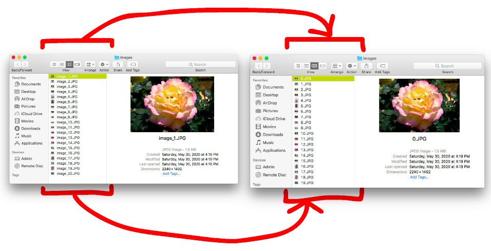

<!--
***Thank you for checking out my project. I am open to any suggestions for improvement.
***Please fork the repository and create a pull request or open an issue with the
***tag "improvement".
-->

# File Renaming System

<br />
<p align="center">
  <a href="https://github.com/reoyamanaka/file_renaming_system.git">
    
  </a>

  <h3 align="center">File Renaming System</h3>

  <p align="center">
    A Python program that systematically renames numerous JPG files in a folder such that they contain only numbers and start at index 0.
    <br />
    <a href="https://github.com/reoyamanaka/file_renaming_system.git"><strong>Explore the docs »</strong></a>
    <br />
    <br />
    <a href="https://youtu.be/TDuegyfaWH4">View Demo</a>
    .
    <a href="https://github.com/reoyamanaka/file_renaming_system/issues">Report Bug</a>
  </p>
</p>

<!-- Table of Contents -->

* [About the Project](#about-the-project)
  * [Built with](#built-with)
* [Getting Started](#getting-started)
  * [Prerequisites](#prerequisites)
  * [Installation](#installation)
* [Usage](#usage)
* [Contributing](#contributing)
* [License](#license)


## About The Project
<p align="center">
    A Python program that systematically renames numerous JPG files in a folder such that they contain only numbers and start at index 0. More specifically, the program extracts only the numbers from the filenames and then adjusts these numbers so that all filenames include only its adjusted number and the first file's name is 0 ("0.JPG"). I wrote this program so that I could reference the image files more systematically in another web project, where I iterate through the images on multiple occasions.
  
</p>

### Built With

* Python 3.8.1
* IDLE 3.8.1
* macOS High Sierra Version 10.13.6

## Getting Started

To get a local copy up and running follow these simple steps.

### Prerequisites

* <a href="https://www.python.org/downloads/">Python</a>

### Installation

1. Clone the repository
```sh
git clone https://github.com/reoyamanaka/file_renaming_system.git
```

## Usage


## Contributing

I would greatly appreciate any contributions.

1. Fork the Project
2. Create your Feature Branch (`git checkout -b feature/CoolFeature`)
3. Commit your Changes (`git commit -m 'Added some CoolFeature'`)
4. Push to the Branch (`git push origin feature/CoolFeature`)
5. Open a Pull Request


## License

Distributed under the GNU Affero General Public License v3.0 License. See `LICENSE` for more information.

## Contact

Reo Yamanaka - [LinkedIn](https://www.linkedin.com/in/reo-yamanaka-7a2289119/) - [My YouTube channel](https://www.youtube.com/channel/UCBwqp_MEM2XcSnq7kRvOB3A) - ryamanaka807@gmail.com

Project Link: [https://github.com/reoyamanaka/file_renaming_system](https://github.com/reoyamanaka/file_renaming_system)
